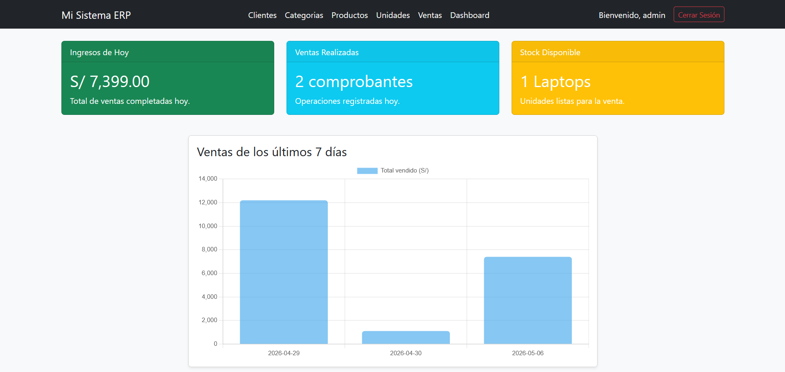
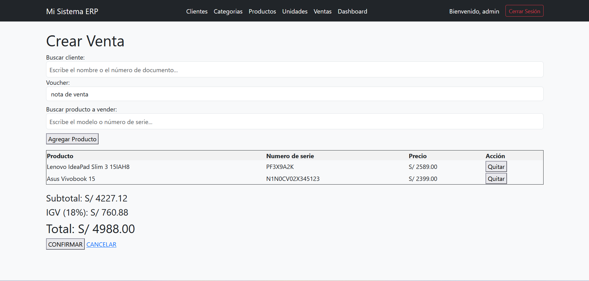
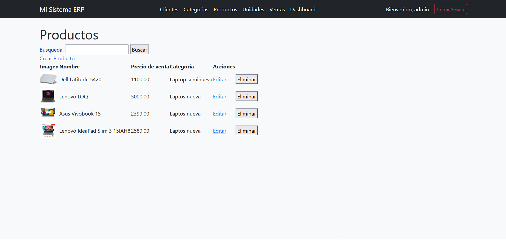
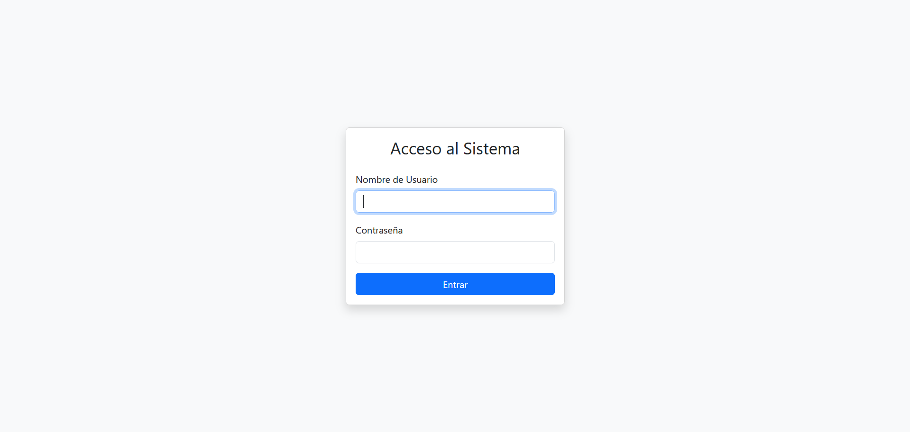
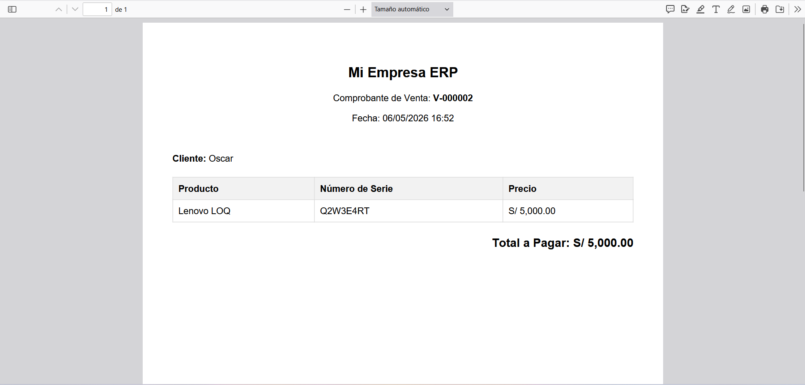
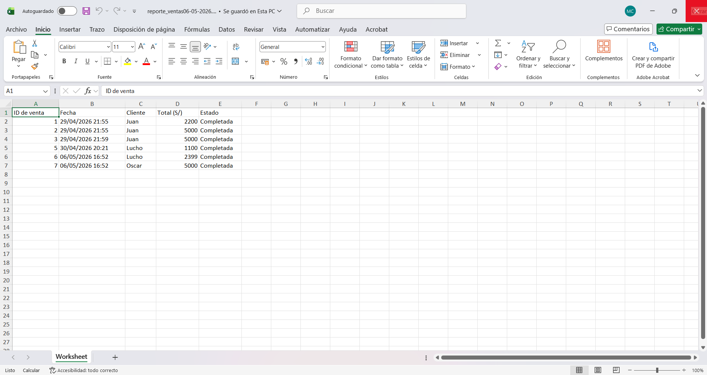
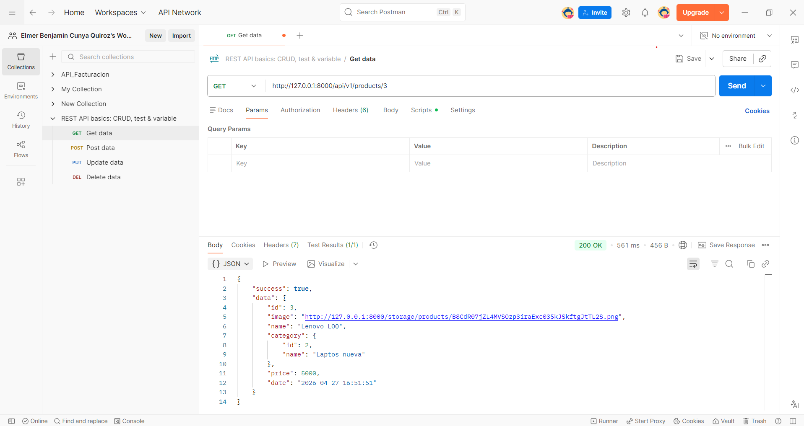

# 🖥️ ERP/POS — Sistema de Gestión para Tienda de Laptops


Sistema ERP/POS desarrollado en Laravel para la gestión integral de una tienda de laptops: control de inventario por número de serie, ventas con carrito dinámico, facturación en PDF, reportes en Excel y dashboard con indicadores clave.

> Proyecto desarrollado como práctica intensiva para aplicar a posiciones Junior Backend Developer.

---

> 🌐 **Demo en vivo:** https://laptop-store-erp.onrender.com
> 👤 **Acceso demo:** `admin` / `admin123`
> ⚠️ *Servidor gratuito: la primera carga puede tardar ~50-60 segundos (cold start).*

---

## 📸 Capturas

### Dashboard con KPIs y reportes


### Venta con carrito AJAX


### Gestión de productos


### Login


### Comprobante PDF


### Exportación a Excel


### API REST con respuesta JSON


---

## 🚀 Funcionalidades

- 🔐 **Autenticación y roles** (admin / empleado) con middleware
- 📦 **Gestión de productos** con imágenes (upload, edición y borrado seguro de archivos)
- 🔢 **Inventario por número de serie** — cada laptop es una unidad única rastreable
- 🛒 **Ventas con carrito AJAX** — agregar/quitar productos sin recargar página
- 📄 **Comprobantes PDF** generados con DomPDF, numeración por tipo de voucher
- 📊 **Exportación a Excel** con Laravel Excel (formato auto-ajustado)
- ↩️ **Anulación de ventas** con devolución automática de stock vía transacciones DB
- 📈 **Dashboard interactivo** con KPIs, Top 5 productos, Top 3 clientes, últimas ventas y gráfica de los últimos 7 días (Chart.js)
- 👥 **Gestión de clientes** con validación de DNI / RUC / CE
- 🔑 **API REST autenticada con Laravel Sanctum** (Bearer tokens) + colección Postman pública

---

## 🧠 Decisiones técnicas

### 🔒 Bloqueo pesimista en el registro de ventas

**Problema:** Si dos usuarios venden simultáneamente la última unidad de una laptop, ambas peticiones podrían pasar la validación, dejando el inventario en negativo.

**Solución elegida:** Implementé `DB::transaction` junto con `lockForUpdate` en el `SaleController` para bloquear la lectura de la fila.

**Por qué pesimista:** En un POS, la concurrencia es normal. Elegí el bloqueo pesimista porque usar el optimista obligaría a cancelar y rehacer la venta completa ante un choque, afectando al cajero.

**Trade-off aceptado:** Contención temporal de la fila (milisegundos), un costo mínimo frente a garantizar un inventario 100% consistente.

---

### ⚡ Eager Loading para mitigar el problema de consultas N+1

**Problema:** Al listar 50 ventas en el dashboard junto con sus relaciones, el comportamiento por defecto de Eloquent (Lazy Loading) disparaba 51 consultas a la base de datos (N+1), aumentando drásticamente la latencia de red.

**Solución elegida:** Implementé Eager Loading utilizando `with('client')` al listar ventas y `with('product')` al cargar unidades disponibles en el formulario de venta.

**Por qué Eager Loading:** Opté por esta técnica porque consolida la carga de datos relacionados en solo 2 queries centralizadas, reduciendo de inmediato el tiempo de respuesta del servidor.

**Trade-off aceptado:** Incremento menor en el uso de memoria RAM para almacenar los modelos hidratados, un costo imperceptible frente a la ganancia en fluidez y velocidad del sistema.

---

### 🛡️ Form Requests para Validación y Autorización

**Problema:** Mezclar la lógica de validación y autorización dentro de los controladores generaba clases sobrecargadas y violaba el Principio de Responsabilidad Única.

**Solución elegida:** Implementé clases FormRequest personalizadas (ej. `StoreProductRequest`) utilizando el método `authorize()` para validar roles y `rules()` para las reglas de negocio.

**Por qué Form Requests:** Decidí usar esta capa intermedia para aislar la seguridad y garantizar que el controlador reciba únicamente datos limpios, centralizando además los mensajes de error.

**Trade-off aceptado:** Aumento en la cantidad de archivos del proyecto, un sacrificio necesario a cambio de un código modular, testeable y fácil de mantener.

---

### 📡 API Resources para un Contrato Estable

**Problema:** Devolver modelos de Eloquent directamente en las respuestas de la API exponía la estructura interna de la base de datos y amenazaba con romper las aplicaciones cliente ante cualquier cambio de columnas.

**Solución elegida:** Implementé clases `JsonResource` para transformar las respuestas JSON y apliqué paginación nativa en los endpoints de listados.

**Por qué API Resources:** Decidí crear esta capa para establecer un contrato de datos estable. Así puedo refactorizar la base de datos internamente sin afectar a los consumidores de la API.

**Trade-off aceptado:** Agrega una capa extra de procesamiento de datos, un costo menor frente al beneficio de mantener el encapsulamiento y la retrocompatibilidad.

---

### 🔑 Laravel Sanctum con API tokens (stateless)

**Problema:** La API estaba expuesta sin autenticación, cualquier cliente podía consumir endpoints sensibles. Además, necesitaba un mecanismo compatible con clientes externos (Postman, móvil, otros backends) sin depender de cookies de sesión.

**Solución elegida:** Implementé **Sanctum en modo API tokens** (no SPA). El endpoint `POST /api/v1/login` valida credenciales y devuelve un Bearer token; el resto de rutas vive bajo el middleware `auth:sanctum`.

**Por qué API tokens y no SPA:** Sanctum SPA es stateful (cookie + CSRF, requiere mismo dominio entre front y back). API tokens es **stateless**: cada request lleva el token en el header `Authorization`, el servidor no guarda sesión. Como los consumidores objetivo son clientes externos, stateless es la elección natural y evita peleas con CORS/CSRF.

**Por qué Sanctum y no Passport/JWT:** Passport implementa OAuth2 completo, overkill para este caso. Sanctum es la recomendación oficial de Laravel desde la v8 para APIs simples, y reutiliza el modelo `User` existente (solo añade el trait `HasApiTokens`) sin crear guards paralelos.

**Trade-off aceptado:** Los tokens no expiran por defecto (`expiration => null`), suficiente para MVP y demo. En producción se configuraría expiración + rotación de refresh tokens.

> 🛡️ **Nota de seguridad:** Sanctum guarda en BD únicamente el **hash SHA-256** del token. El string plano se construye una sola vez en memoria al llamar `createToken()->plainTextToken` y se devuelve al cliente. Si se pierde, no se puede recuperar: hay que generar uno nuevo. Mismo patrón de almacenamiento que las contraseñas con bcrypt, pero con SHA-256 (más rápido) porque los tokens ya son aleatorios y largos, no se rompen por fuerza bruta.

---

## 🛠️ Stack Técnico

| Categoría | Tecnología |
|-----------|------------|
| Backend | PHP 8.2, Laravel 12.x |
| Frontend | Blade, Bootstrap 5, JavaScript (AJAX) |
| Base de datos | MySQL |
| Visualización | Chart.js |
| Reportes | DomPDF, Laravel Excel (Maatwebsite) |
| Autenticación web | Laravel Auth + Middleware de roles |
| Autenticación API | Laravel Sanctum (Bearer tokens) |
| Testing | Pest + GitHub Actions (CI) |
| Infraestructura / DevOps | Docker, Render (Web Service), Clever Cloud (MySQL) |

---

## ⚙️ Instalación local

Requisitos: PHP 8.2+, Composer, MySQL, Node.js.

```bash
# 1. Clonar el repositorio
git clone https://github.com/elmercunya/laptop-store-erp.git
cd laptop-store-erp

# 2. Instalar dependencias PHP
composer install

# 3. Instalar dependencias frontend
npm install && npm run build

# 4. Configurar variables de entorno
cp .env.example .env
php artisan key:generate

# 5. Configurar la base de datos en .env, luego:
php artisan migrate --seed

# 6. Crear enlace simbólico para imágenes
php artisan storage:link

# 7. Levantar el servidor
php artisan serve
```

Acceder en http://localhost:8000.

**Usuario de prueba:**

| Campo | Valor |
|-------|-------|
| Usuario | `admin` |
| Password | `admin123` |

---

## 🗂️ Arquitectura del proyecto

El sistema sigue el patrón MVC estándar de Laravel:

- **Models:** representan las entidades del negocio (`Product`, `Sale`, `Client`, `Unit`)
- **Controllers:** manejan la lógica de cada módulo (`ProductController`, `SaleController`, `ClientController`, `Api\AuthController`, `Api\ProductApiController`, etc.)
- **Migrations:** definen el esquema de BD versionado
- **Views (Blade):** layout maestro con componentes reutilizables
- **Middleware:** control de acceso por rol (web) y `auth:sanctum` (API)

**Aspectos técnicos destacables:**

- Transacciones DB en anulación de ventas para garantizar integridad del stock
- Eager Loading con `with()` y `orWhereHas()` para evitar N+1 queries en buscadores
- Manejo de archivos: borrado del archivo físico anterior al actualizar la imagen de un producto
- Numeración correlativa de comprobantes por tipo de voucher (boleta/factura)
- API stateless con Bearer tokens, separada del flujo web por sesión

---

## 🔌 API REST v1 — Cómo probar

La API está protegida con Laravel Sanctum (Bearer tokens). El único endpoint público es `POST /login`; el resto requiere enviar el header `Authorization: Bearer <token>`.

**URL base producción:** `https://laptop-store-erp.onrender.com/api/v1`

### Probar en 3 pasos con Postman

1. Descargar los archivos de la colección:
   - [Colección Postman](docs/postman/laptop-store-erp.postman_collection.json)
   - [Environment Producción](docs/postman/production.postman_environment.json)

2. Importar ambos archivos en Postman (botón **Import** → arrastrar los JSON) y seleccionar el environment **Production** (esquina superior derecha).

3. Ejecutar requests en este orden:
   - `POST Auth/Login` → envía las credenciales demo. El script de la pestaña **Tests** guarda automáticamente el token en la variable `{{token}}`.
   - `GET Auth/Me` → devuelve el usuario autenticado.
   - `GET Products/List` → lista productos paginados con filtros opcionales.
   - `POST Auth/Logout` → invalida el token actual.

> 💡 La autenticación es transparente: una vez hecho Login, los demás requests usan `{{token}}` automáticamente. Cero copy-paste manual.

### Credenciales demo

| Campo | Valor |
|-------|-------|
| Usuario | `admin` |
| Password | `admin123` |

> ⚠️ **Nota sobre el demo en vivo (plan gratuito de Render):**
> - **Cold start:** El primer request puede tardar ~50-60s si el servicio estaba dormido por inactividad.
> - **Base de datos (MySQL en Clever Cloud):** Los datos persisten entre reinicios del contenedor (productos, ventas, clientes registrados no se pierden).
> - **Archivos subidos (imágenes de productos, PDFs de comprobantes):** Se almacenan en el filesystem efímero del contenedor y se pierden cuando Render reinicia el servicio (~cada 24h). Los datos asociados en BD permanecen, solo desaparece el archivo físico.

### Endpoints disponibles

| Método | Ruta | Auth | Descripción |
|--------|------|------|-------------|
| `POST` | `/api/v1/login` | ❌ | Valida credenciales y devuelve un Bearer token |
| `GET` | `/api/v1/me` | ✅ | Devuelve el usuario autenticado |
| `POST` | `/api/v1/logout` | ✅ | Invalida el token actual |
| `GET` | `/api/v1/products` | ✅ | Lista productos con paginación y filtros |
| `GET` | `/api/v1/products/{id}` | ✅ | Detalle de un producto |

### Parámetros de consulta (`GET /api/v1/products`)

| Parámetro | Tipo | Descripción |
|-----------|------|-------------|
| `search` | string | Búsqueda parcial por nombre |
| `category_id` | integer | Filtrar por categoría |
| `per_page` | integer | Resultados por página (máx. 50, default 10) |
| `page` | integer | Número de página |

### Ejemplo de respuesta — `POST /api/v1/login`

**Petición:**
```json
{
  "user": "admin",
  "password": "admin123"
}
```

**Respuesta (200 OK):**
```json
{
  "token": "1|abcdef1234567890...",
  "user": {
    "id": 1,
    "user": "admin",
    "role": "admin"
  }
}
```

**Respuesta (422 Unprocessable Entity) — credenciales inválidas:**
```json
{
  "message": "Credenciales inválidas",
  "status": "error"
}
```

### Ejemplo de respuesta — `GET /api/v1/products`

```json
{
  "success": true,
  "data": [
    {
      "id": 4,
      "image": "http://localhost:8000/storage/products/D1DvLdAspg82NPZfV2Zcb2082udyyNg4Oofi4N8O.png",
      "name": "Asus Vivobook 15",
      "category": { "id": 2, "name": "Laptops nuevas" },
      "price": 2399,
      "date": "2026-05-04 16:48:34"
    },
    {
      "id": 5,
      "image": "http://localhost:8000/storage/products/mt3GHly233FYpyAaR4Ry40ojQsqMmgZtkisy7znt.png",
      "name": "Lenovo IdeaPad Slim 3 15IAH8",
      "category": { "id": 2, "name": "Laptops nuevas" },
      "price": 2589,
      "date": "2026-05-04 17:01:47"
    }
  ],
  "meta": {
    "current_page": 2,
    "last_page": 2,
    "per_page": 2,
    "total": 4
  }
}
```

### Respuestas de error

| Código | Cuándo | Cuerpo |
|--------|--------|--------|
| `401 Unauthorized` | Token ausente o inválido en una ruta protegida | `{ "message": "Unauthenticated." }` |
| `404 Not Found` | El recurso solicitado no existe | `{ "success": false, "message": "Producto no encontrado" }` |
| `422 Unprocessable Entity` | Validación fallida (login, filtros) | `{ "message": "Credenciales inválidas", "status": "error" }` |

### Aspectos técnicos

- Sanctum API tokens (stateless) — autenticación vía header `Authorization: Bearer <token>`, sin cookies ni CSRF
- Hashing SHA-256 del token en BD — el string plano solo es visible al crearse
- API Resources para transformación de respuestas y desacople del modelo de BD
- Eager loading con `with()` para evitar el problema N+1
- Paginación con límite máximo para prevenir abusos
- Versionado con prefijo `/v1` para evolución sin romper clientes
- Códigos HTTP semánticos (200, 401, 404, 422)

---

## 📌 Roadmap

- [x] API REST básica con Resources y paginación
- [x] Autenticación API con Sanctum
- [x] Colección Postman pública con auto-token
- [x] Tests con Pest
- [x] Dockerización
- [x] Despliegue en producción

---

## 👤 Autor

**Elmer Benjamin Cunya Quiroz** — Desarrollador Backend Junior

📧 elmer.cunyaq@gmail.com
💼 [LinkedIn: in/elmer-cunya](https://linkedin.com/in/elmer-cunya)
🐙 [GitHub: elmercunya](https://github.com/elmercunya)